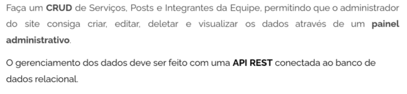
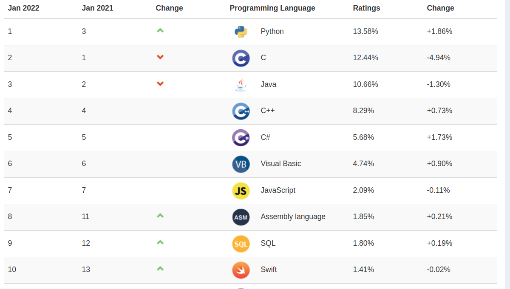

# Test Deloitte - Desafio Back-End Agência Cronos



## Atalhos

- [Sobre as tecnologias usadas no projeto Backend](#technologies)
- [Como rodar o projeto](#runProject)
- [Documentação da API](#documentation)
- [REFERÊNCIAS](#references)

### Sobre as tecnologias usadas no projeto Backend <a name="technologies"></a>
1. API
> Segundo o conceituado site MDN (Rede de Desenvolvedores da Mozilla),
uma API pode ser compreendida como uma espécie de contrato, que define as
regras e especificações de interações de uma aplicação, fornecendo mecanismos de
comunicação através de perguntas e respostas com outros componentes de
software, browsers ou sistemas de terceiro.

2. REST 
> O MDN (2021) conceitua o REST como um grupo de restrições de design que
segue padronização de operações e formatos dentro de uma arquitetura de
software. Isto provê sistemas distribuídos eficientes, confiáveis e escaláveis. IBM
(2021) diz que um design REST provê um mecanismo que permite que um aplicativo
ou serviço acesse um recurso em outro aplicativo ou serviço, essa comunicação é
chamada de cliente-servidor.

3.  HTTP
> STALLINGS (2016) define o HTTP como um protocolo cliente/servidor, sem
estado, em que cada transação é tratada de forma independente. Portanto, uma
comunicação típica criará um novo túnel de comunicação entre cliente/servidor, que
será encerrada assim que a transação for concluída.

 - GET - Solicita a representação de um recurso específico.
 - HEAD - Solicita uma resposta idêntica ao método GET, porém sem um corpo
de resposta.
 - POST - Submete dados a um recurso específico, normalmente causando
mudança de estado do recurso ou efeitos no servidor.
 - PUT - Atualiza todos os dados atuais de uma representação do recurso de
destino.
 - DELETE - Remove um recurso específico.
 - PATCH - Atualiza dados parciais de uma representação do recurso de
destino.

4. JSON
> JSON é uma estrutura de dados com uma sintaxe simples para serialização
de objetos, matrizes, números, strings, booleanos e nulos, MDN (2021). Segundo o
site json.org, a JSON (Notação de Objetos JavaScript) é um formato leve de troca de
dados, de fácil escrita e leitura para seres humanos assim como para máquinas.

5. Python
> LJUBOMIR (2016), Python foi concebido no final da década de 1980 pelo
programador holandês Guido van Rossum. Esta linguagem de programação é um
projeto de código-fonte aberto, projetado para tornar programas legíveis. Possui uma
biblioteca nativa rica em funções, o que possibilita criar softwares de aparência
relativamente simples, porém muito poderosos. A figura abaixo mostra as
linguagens de programação mais populares segundo o Índice TIOBE, comumente
alimentado pela comunidade de engenheiro das grandes empresas do Vale do
Silício como Google, Yahoo, Wikipedia, Amazon, etc..

<br/>

[Fonte: tiobe.com/tiobe-index](https://www.tiobe.com/tiobe-index)



6. Django
> Django é um Framework Python para desenvolvimento de software que torna
as tarefas comuns de desenvolvimento Web rápidas e fáceis. Django se baseia em
uma estrutura web Python de alto nível que incentiva o design limpo e pragmático.
Além disso, é um projeto de código-aberto, construído pela comunidade Python,
desenvolvedores experientes que se preocupou em abstrair a maioria dos
problemas comuns em desenvolvimento web, para que o desenvolvedor se
concentre apenas em escrever os aplicativos de acordo com suas necessidades de
negócio sem precisar reinventar a roda, Django Software Foundation (2021).
 
7. DRF
> O DRF, do acrônimo Django Rest Framework, facilita a construção de APIs
REST baseadas em Django. Com o DRF é simples escrever APIs baseadas
trafegando dados via JSON.


8. PostgreSQL
> De acordo com a IBM (2021) PostgreSQL é um banco de dados de código
aberto com uma forte reputação por sua confiabilidade e flexibilidade. Originalmente
desenvolvido em 1986, como uma continuação do INGRES (um projeto de banco de
dados SQL de código aberto com início na década de 70), foi uma ideia do Professor
de Ciência da Computação em Berkeley Michael Stonebraker. O PostgreSQL
oferece um ótimo suporte ao Django Framework, e é fortemente recomendado pela
documentação do Django.


### Como rodar o projeto <a name="runProject"></a>
Para rodar este projeto no seu ambiente local você precisa executar as etapas a seguir
 - Instalar o [docker](https://docs.docker.com/engine/install/) e [docker-compose](https://docs.docker.com/compose/install/)
 - Ter o [python](https://www.python.org/downloads/) instalado e configurar a [virual enviroment](https://packaging.python.org/en/latest/guides/installing-using-pip-and-virtual-environments/#creating-a-virtual-environment)
 - Subir o banco de dados Postgresql
   - Se tiver suporte ao Makefile
     - ```
        make psql_start
        ```
   - Se não
     - ```
        docker-compose -f .docker/docker-compose.yml up -d db_postgresql
        ```
 - Instalar as dependências
   - Se tiver suporte ao Makefile
     - ```
        make setUp
        ```
   - Se não
     - ```
        pip install -r requirements.txt
        ```
 - Rodar as migrações
    - Se tiver suporte ao Makefile
      - ```
         make migrations
         ```
      - ```
         make migrate
         ```
    - Se não
      - ```
         python manage.py makemigrations
         ```
      - ```
         python manage.py migrate
         ```
 - Rodar o servidor
   - Se tiver suporte ao Makefile
     - ```
        make server
        ```
 - Se não
   - ```
      python manage.py runserver
      ```
    

### Documentação da API <a name="documentation"></a>

##### POSTMAN DOCUMENTATION

[](https://app.getpostman.com/run-collection/17433768-20ece34f-b70d-4c29-873c-897280c39bac?action=collection%2Ffork&collection-url=entityId%3D17433768-20ece34f-b70d-4c29-873c-897280c39bac%26entityType%3Dcollection%26workspaceId%3D3d1981a7-6be9-4879-b1b8-af59bd5f5889#?env%5Blocal%5D=W3sia2V5IjoiYmFzZV91cmwiLCJ2YWx1ZSI6Imh0dHA6Ly8xMjcuMC4wLjE6ODAwMC9hcGkiLCJlbmFibGVkIjp0cnVlfV0=)


### REFERÊNCIAS <a name="references"></a>
API, MDN. Disponível em: https://developer.mozilla.org/pt-BR/docs/Glossary/API.

DJANGO SOFTWARE FOUNDATION, 2021. Disponível em:https://www.djangoproject.com/.

REST APIs. Disponível em: https://www.ibm.com/cloud/learn/rest-apis.

IBM Cloud Education, What is PostgreSQL. Disponível em: https://www.ibm com/cloud/learn/postgresql.

LJUBOMIR, PERKOVIC,. Introdução à Computação Usando Python - Um Foco no  Desenvolvimento de Aplicações. Grupo GEN, 2016.

MDN, HTTP. Disponível em: https://developer.mozilla.org/pt-BR/docs/Web/HTTP.

MDN, REST. Disponível em: https://developer.mozilla.org/pt-BR/docs/Glossary/REST.

STALLINGS, William. Redes e Sistemas de Comunicação de Dados. Grupo GEN, 2016.